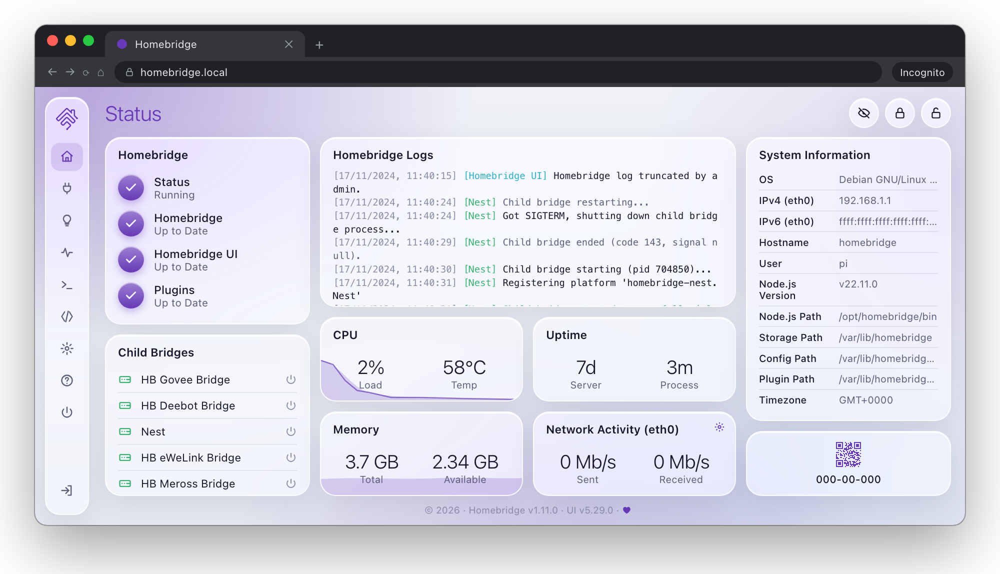
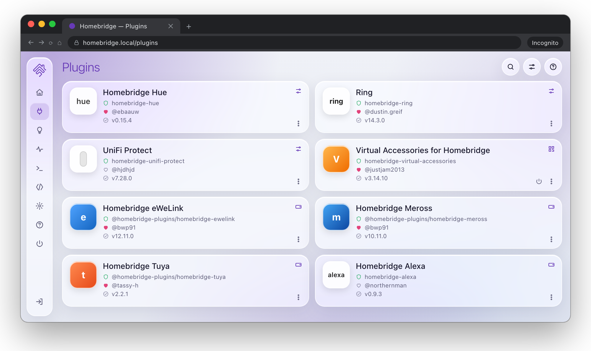
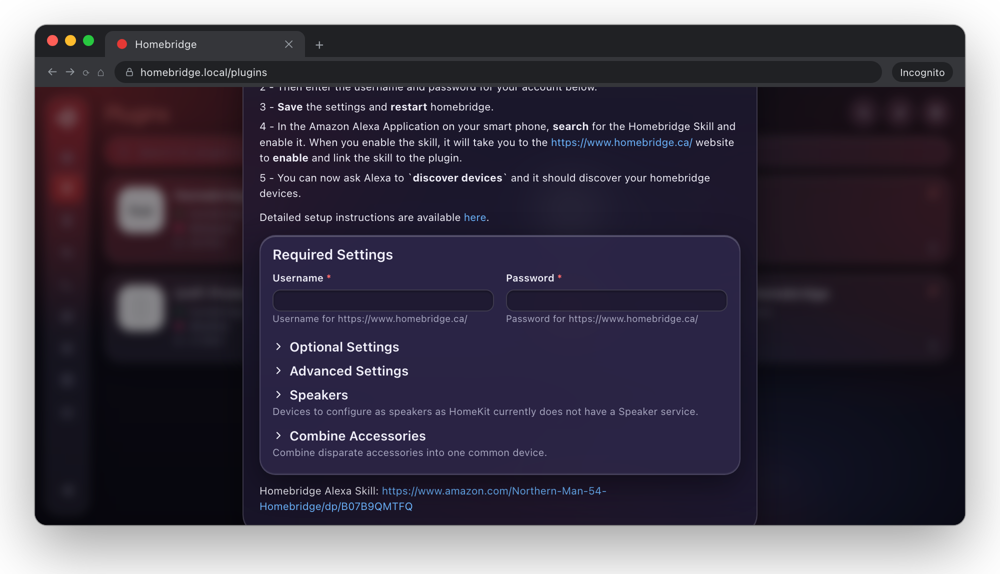
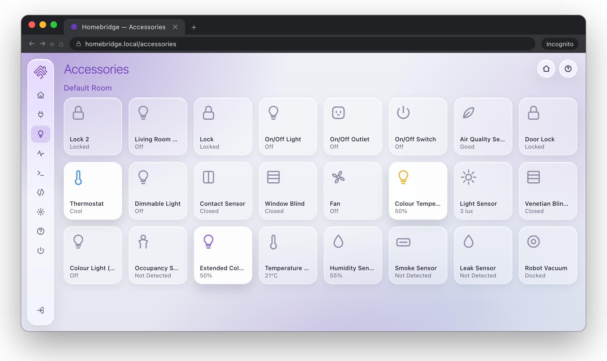
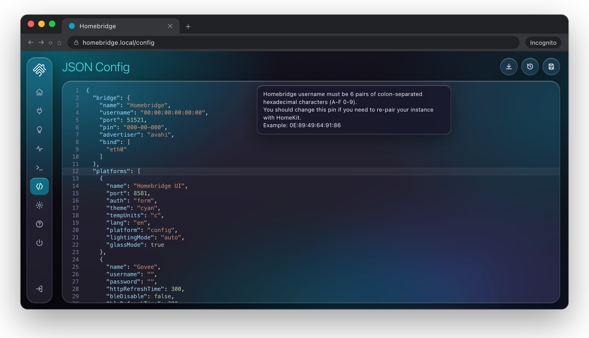
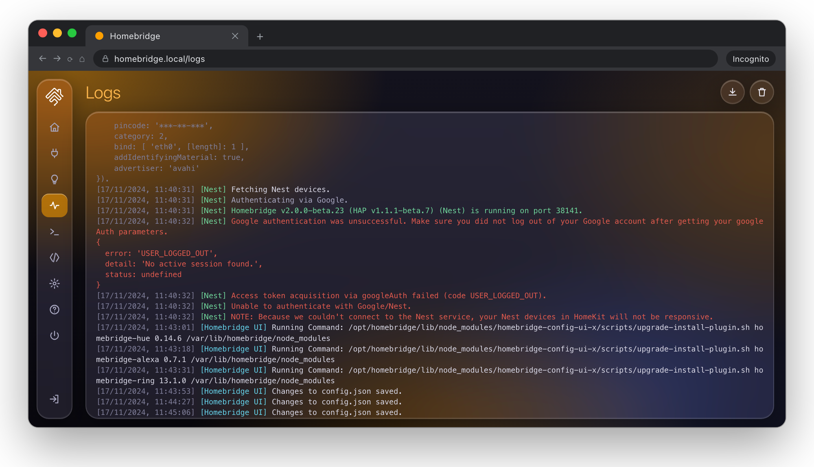

# Homebridge Glass UI

[](https://badge.fury.io/js/@mp-consulting%2Fhomebridge-config-glass-ui)
[](https://github.com/mp-consulting/homebridge-config-glass-ui/actions/workflows/build.yml)

A web interface for managing, configuring and controlling [Homebridge](https://homebridge.io), with a liquid glass design.



## Features

- **Liquid glass design** in light and dark mode, tinted by the theme colour you pick
- Install, configure, update and remove Homebridge plugins, with a check of which plugins would not support a Node.js or Homebridge upgrade
- Visual settings forms for plugins that ship a config schema
- Edit `config.json` with syntax checking, validation and automatic backups you can compare with the current config
- A customisable widget dashboard for monitoring your server (network traffic in bits or bytes, sent and received charted separately)
- Live Homebridge logs and a web terminal
- View and control your accessories from any browser, with history charts of their sensor readings
- Scenes that set several accessories at once, on demand or on a schedule
- Run plugins as child bridges, with a health page that shows uptime and restarts and detects crash loops
- Back up and restore your whole Homebridge instance
- An optional **Assistant** (bring your own AI provider): Log Doctor, Config Copilot, a chat that can look things up and act for you, update risk briefings, room suggestions and a daily digest
- A REST API (documented at `/swagger`) with API tokens for scripts and the Assistant's MCP server
- Notifications by webhook, ntfy, Pushover or Telegram when Homebridge goes down, a child bridge crash loops, updates are available or a backup fails
- Switch between several Homebridge instances from the menu
- Installs to your phone's home screen as an app, with a Quick Controls page for your favourite accessories
- `hb-service`, a command that installs Homebridge as a service on Linux, macOS, FreeBSD and Windows

## Installation

One command replaces your current Homebridge web interface with Glass UI. Run it from the Homebridge shell: the terminal in your current web interface, `hb-shell` on the Synology, Debian and Raspberry Pi packages, or `docker exec -it <container> hb-shell` with Docker:

```sh
npx @mp-consulting/homebridge-config-glass-ui
```

It removes the official interface (`homebridge-config-ui-x`), installs Glass UI in its place and, on the Synology, Debian, Raspberry Pi and Docker packages, links the folder those packages start the interface from to Glass UI. If anything fails, it puts the official interface back. Then restart Homebridge (Package Center on a Synology, `sudo hb-service restart` elsewhere, or restart the container). Your login, settings, plugins and accessories carry over: Glass UI uses the same `config` platform block and the same `hb-service` command.

Run the same command again to update, or after an update of the Homebridge package or a new container has brought the official interface back. To go back to the official interface:

```sh
npx @mp-consulting/homebridge-config-glass-ui revert
```

Add `@next` to the package name for the current beta (`npx @mp-consulting/homebridge-config-glass-ui@next`).

### Updating

Once Glass UI is installed, update it like a plugin: **Plugins**, then **Update** on the Homebridge Glass UI card (or Update All). When the update finishes the interface restarts on its own and the page reloads on the new version.

Updating from 2.0.0-beta.3 or earlier still runs that version's update code, which does not restart the interface afterwards. If the version on the home page has not changed once the update is done, use **Restart** from the power menu once.

### New installs

On a machine without Homebridge, install it with npm and set it up as a system service:

```sh
npm install -g --allow-scripts=@homebridge/node-pty-prebuilt-multiarch @mp-consulting/homebridge-config-glass-ui
sudo hb-service install
```

npm 12 and later skip dependency install scripts unless they are allowed. `--allow-scripts` lets the terminal's native module install; without it the built-in terminal won't work.

The UI then listens on port `8581`, for example `http://localhost:8581`. The default username and password are both `admin`.

### Installing by hand

What the command does on the Synology package, as the `homebridge` user in `hb-shell` (the Debian, Raspberry Pi and Docker packages use `/opt/homebridge` instead of `/var/packages/homebridge/target/app`):

```sh
npm uninstall -g homebridge-config-ui-x
npm install -g --allow-scripts=@homebridge/node-pty-prebuilt-multiarch @mp-consulting/homebridge-config-glass-ui
ln -s @mp-consulting/homebridge-config-glass-ui /var/packages/homebridge/target/app/lib/node_modules/homebridge-config-ui-x
```

The packages start the interface from that `homebridge-config-ui-x` folder rather than through `hb-service`; without the link they no longer start Homebridge at all.

## Configuration

Settings live in the `config` platform block of `config.json`. They can all be changed from the **Settings** screen.

```json
{
  "platform": "config",
  "name": "Homebridge Glass UI",
  "port": 8581,
  "theme": "deep-purple",
  "lightingMode": "auto",
  "glassMode": true
}
```

| Option         | Default       | Description                                             |
| -------------- | ------------- | ------------------------------------------------------- |
| `theme`        | `deep-purple` | Accent colour. It also tints the glass background.      |
| `lightingMode` | `auto`        | `auto` follows the browser, or force `light` or `dark`. |
| `glassMode`    | `true`        | Set to `false` to switch back to flat, opaque surfaces. |

## API access

The REST API lives under `/api` and is documented at `/swagger` on your Glass UI. Scripts and tools such as the Assistant's MCP server (`@mp-consulting/homebridge-ai-kit`) authenticate with an **API token** rather than a password: create one under **Users**, **API Tokens** (administrators only). The token (`hbg_…`) is shown once; send it as `Authorization: Bearer hbg_…`, or as the socket.io handshake `auth.token`.

- **Read-only** tokens act as a non-admin user and may only make `GET`/`HEAD` requests (anything else answers `403`).
- **Admin** tokens act as an administrator.
- Tokens can expire (30 days, 90 days, a year) or never; revoking one takes effect immediately. Only a hash is stored, in `.uix-api-tokens.json` in the Homebridge storage folder.

Endpoints the Assistant relies on:

| Method and path                                                            | What it does                                                                                                     |
| -------------------------------------------------------------------------- | ---------------------------------------------------------------------------------------------------------------- |
| `GET/POST /api/auth/tokens`, `DELETE /api/auth/tokens/:id`                 | List, create and revoke API tokens (admin)                                                                       |
| `POST /api/plugins/install`, `/update`, `/uninstall`                       | Start a plugin job with `{ name, version? }`; answers `202 { jobId }` (admin)                                    |
| `GET /api/plugins/jobs/:jobId`                                             | A job's `status` (`running`, `succeeded`, `failed`) and npm `output`; kept for an hour after it finishes (admin) |
| `GET /api/status/homebridge/child-bridges`                                 | Child bridges and their status                                                                                   |
| `PUT /api/server/restart/:deviceId`, `/stop/:deviceId`, `/start/:deviceId` | Restart, stop or start a child bridge (admin)                                                                    |

## Assistant

The Assistant is off until an administrator turns it on under **Settings**, **Assistant**. It uses [`@mp-consulting/homebridge-ai-kit`](https://github.com/mp-consulting/homebridge-ai-kit) and the AI provider you choose: Anthropic (Claude), OpenAI, Google Gemini, or any OpenAI-compatible server such as Ollama or LM Studio on your own network. Settings live in the kit's `HomebridgeAiKit` platform block of `config.json`; installing the kit as a Homebridge plugin as well is recommended, so Homebridge knows the platform.

| Setting                | What it does                                                                                       |
| ---------------------- | -------------------------------------------------------------------------------------------------- |
| Enable                 | Turns every Assistant feature on or off. While it is off, no Assistant button is shown.            |
| Provider, Model        | Leave the model empty for the provider's default (`claude-sonnet-5-5`, `gpt-5`, `gemini-2.5-pro`). |
| API key                | Write-only: it is saved to `config.json` and never sent back to the browser.                       |
| Server URL             | For an OpenAI-compatible server, e.g. `http://127.0.0.1:11434/v1` (no key needed).                 |
| Maximum answer length  | Output tokens per answer (default 2048).                                                           |
| Test connection, Usage | A one-word test with the saved settings, and the tokens used since Glass UI started.               |

What it adds:

- **Log Doctor**: **Diagnose** on the Logs page and in the logs widget reads the end of the Homebridge log and explains what is wrong, in a side panel.
- **Config Copilot**: **Describe what you want** in a plugin's settings, or the wand button in the config editor. The Assistant writes the config block from the plugin's schema; you review it as a diff and **Apply** saves it the usual way (with a backup), or **Reject** it.
- **Assistant chat**: Cmd+K (Ctrl+K) or **Assistant** in the menu. It uses the Homebridge tools of ai-kit with your own permissions: non-admins get read-only tools, and every change an administrator's Assistant makes (restart, config write, uninstall…) asks for confirmation first. No answer within a minute is a no.
- **Update risk**: **Assess update risk** in a plugin's update dialog and in Update All summarises the release notes and flags breaking changes.
- **Suggest rooms & names** on the Accessories page proposes rooms and clearer names; you tick the ones to keep.
- **Daily Digest**, a dashboard widget for administrators.

Privacy: logs, configs and accessory names are sent to the provider you picked, with passwords, tokens and keys replaced by `__REDACTED__` first (and restored when a config comes back). Each user may start 20 Assistant requests a minute.

API: `GET /api/ai/status` (any user), `PUT /api/ai/settings`, `POST /api/ai/test`, `POST /api/ai/diagnose-logs`, `POST /api/ai/plugin-config`, `POST /api/ai/update-risk`, `POST /api/ai/organize`, `GET /api/ai/digest` (admin), `POST /api/ai/chat` (any user). They answer `409` while the Assistant is off. Streaming and tool confirmations use the socket.io namespace `ai` (`ai:chunk`, `ai:tool`, `ai:confirm`, `ai:done`, `ai:error`). The chat's tools call this server on `127.0.0.1` with a five-minute token of the signed-in user; set `UIX_AI_LOCAL_URL` if the UI is only reachable at another address (with HTTPS, a certificate Node trusts is needed).

## Screens

### Plugins



### Plugin settings



### Accessories



### Config editor



### Logs



## Development

```bash
git clone https://github.com/mp-consulting/homebridge-config-glass-ui.git
cd homebridge-config-glass-ui

# The server and the UI are two npm packages
npm install && npm install --prefix ui

# Build server + UI
npm run build

# Live reload: UI on :4200, backend on :8581
npm run watch

# Tests and lint
npm test
npm run test:ui
npm run lint
```

## License

MIT. See the [LICENSE](LICENSE) file for details.

## Credits

- [Homebridge](https://homebridge.io/)
- [HAP-NodeJS](https://github.com/homebridge/HAP-NodeJS)
